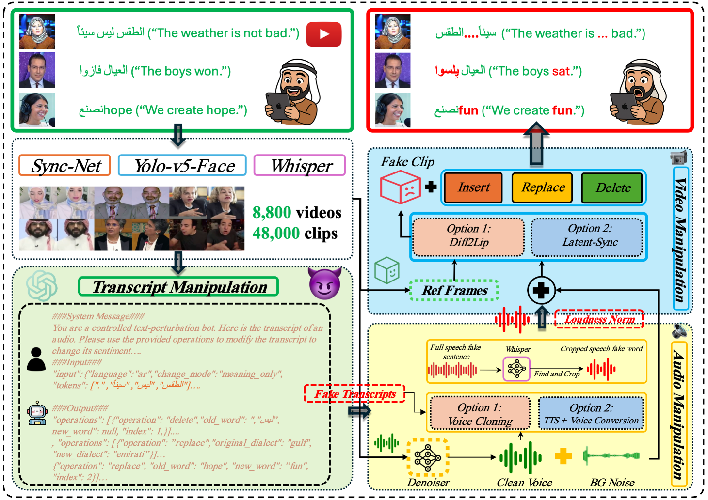
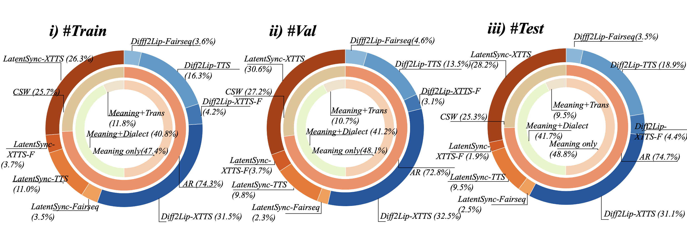
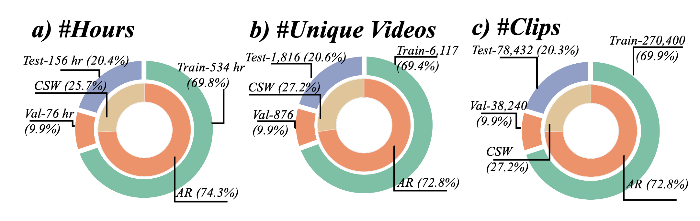

# Tell me Habibi, is it Real or Fake? 

# 

    

#### [Kartik Kuckreja](https://www.linkedin.com/in/kartik-kuckreja-930531221/), [Parul Gupta](https://scholar.google.com.au/citations?user=Wik3mXsAAAAJ&hl=en), [Injy Hamed](https://scholar.google.com/citations?user=N_RhXusAAAAJ&hl=en), [ Thamar Solorio](http://solorio.uh.edu/), [Muhammad Haris Khan](https://m-haris-khan.com/) and [ Abhinav Dhall](https://research.monash.edu/en/persons/abhinav-dhall)

#### **Mohamed bin Zayed University of AI, Monash University**

---

## 📢 Latest Updates
- [ArEnAV-Full](https://huggingface.co/datasets/kartik060702/ArEnAV-Full) and [ArEnAV-Preview](https://huggingface.co/datasets/parulgupta/ArEnAV_preview/viewer/default/test?views%5B%5D=test) is open-sourced 🔥🔥🔥
---

## Dataset Link & Usage Guidelines
The dataset is under the [EULA](EULA_form.pdf). You need to agree and sign the EULA to access the dataset.
A part of the dataset is open for viewing the samples, from all the splits. It can be accessed here: [ArEnAV-Preview](https://huggingface.co/datasets/parulgupta/ArEnAV_preview/viewer/default/test?views%5B%5D=test).

Once the EULA has been signed and emailed, access the dataset from here:
**Download** → [Hugging Face – ArEnAV-Full](https://huggingface.co/datasets/kartik060702/ArEnAV-Full)

1. `git lfs install && git clone https://huggingface.co/datasets/kartik060702/ArEnAV-Full`
---

## Overview
ArEnAV is the **first multimodal deepfake benchmark** that expressly targets Arabic ↔ English **code-switching**.  
It contains **387 k videos (~765 h)** generated with a three-stage pipeline that alters transcripts, clones speech, and diffusion-syncs lips, yielding highly realistic, hard-to-detect fakes.

---

## Content
- [Data Generation](#data-generation)
- [Dataset Statistics](#dataset-statistics)
- [Results](#results)
- [Conclusion](#conclusion)

---

## Data Generation
We show the data generation pipeline for ArEnAV dataset. In a) input videos are analysed
for audio, face, and text extraction. Using few-shot prompts with GPT-4.1-mini, CSW-based spoken
text manipulation is performed. This is followed by speech and face enactment generation. b-d) The
plots show the data splits and CSW distribution.

1. **Transcript rewrite** – GPT-4.1-mini applies eight edit modes (meaning-only, dialect-shift, translation…).
2. **Speech synthesis** – XTTS-v2 / Fairseq-Arabic TTS / GPT-TTS + OpenVoice-v2 clone the original speaker.
3. **Lip-sync** – Diff2Lip & LatentSync diffusion models render mouth motion; 25 random audio/visual perturbations simulate real-world noise.

---

## Dataset Statistics
Dataset distribution for i) Train, ii) Val and iii) Test split. The outer layer shows the
split between various combinations of Text-to-Speech and Lip-Sync models used for audio-visual
manipulation. The middle layer shows the distribution of language in the original transcript, which is
either Ar (Arabic) or CSW (Code-Switched English-Arabic). The inner layer shows the distribution
of different operations applied to the original transcripts, "meaning only", "dialect+meaning", and
"meaning + translation" 

### Cross-Dataset Comparison: Details for publicly available deep - fake datasets in chronologically ascending order.
Cla: Binary classification, SL: Spatial localization, TL: Temporal localization, FS: Face swapping,
RE: Face reenactment, TTS: Text-to-speech, VC: Voice conversion.
| Dataset | Year | Tasks | Modality | Method | #Clips | Multilingual | Code-Switch |
|---------|------|-------|----------|--------|--------|--------------|-------------|
| Google DFD | 2019 | Cla | V | FS | 3 431 | ✗ | ✗ |
| DFDC | 2020 | Cla | AV | FS | 128 154 | ✗ | ✗ |
| DeeperForensics | 2020 | Cla | V | FS | 60 000 | ✗ | ✗ |
| Celeb-DF | 2020 | Cla | V | FS | 6 229 | ✗ | ✗ |
| KoDF | 2021 | Cla | V | FS/RE | 237 942 | ✗ | ✗ |
| FakeAVCeleb | 2021 | Cla | AV | RE | 25 500+ | ✗ | ✗ |
| ForgeryNet | 2021 | SL/TL/Cla | V | FS/RE | 221 247 | ✗ | ✗ |
| ASVSpoof2021-DF | 2021 | Cla | A | TTS/VC | 593 253 | ✗ | ✗ |
| LAV-DF | 2022 | TL/Cla | AV | RE/TTS | 136 304 | ✗ | ✗ |
| DF-Platter | 2023 | Cla | V | FS | 265 756 | ✗ | ✗ |
| **AV-1M** | 2023 | TL/Cla | AV | RE/TTS | 1 146 760 | ✗ | ✗ |
| **PolyGlotFake** | 2024 | Cla | AV | RE/TTS/VC | 15 238 | ✓ | ✗ |
| **Illusion** | 2025 | Cla | AV | FS/RE/TTS | 1 376 371 | ✓ | ✗ |
| **ArEnAV (ours)** | 2025 | Cla/TL | AV | RE/TTS/VC | **387 072** | **✓** | **✓** |

### Multilingual Datasets Comparison: Data distribution in ArEnAV and comparison with other multilingual datasets.
| Subset | Unique Vids | Real | Fake | Non-Eng | CSW Vids | Arabic Vids | Arabic Variants |
|--------|-------------|------|------|---------|----------|-------------|-----------------|
| PolyGlotFake | 766 | 766 | 14 472 | 11 941 | 0 | 1 403 | – |
| Illusion | – | 141 440 | 1 234 931 | 4 385 | 0 | – | – |
| Train | 6 117 | 67 600 | 202 800 | 270 400 | 69 544 | 200 856 | Eg, MSA, Lev, Gulf |
| Val   | 876  | 9 560  | 28 680  | 38 240  | 10 416 | 27 824 | Eg, MSA, Lev, Gulf |
| Test  | 1 816| 19 608 | 58 824 | 78 432 | 19 832 | 58 600 | Eg, MSA, Lev, Gulf |
| **Total** | **8 809** | **96 768** | **290 304** | **387 072** | **99 792** | **287 280** | – |

---

## Results

### Temporal localization results on the test set of ArEnAV. 
*(Full table preserved for reproducibility)*  

| Set | Method | Mod. | AP&nbsp;@0.5 | AP&nbsp;@0.75 | AP&nbsp;@0.9 | AP&nbsp;@0.95 | AR&nbsp;@50 | AR&nbsp;@30 | AR&nbsp;@20 | AR&nbsp;@10 | AR&nbsp;@5 |
|------|----------------|------|--------|---------|--------|---------|-------|-------|-------|-------|------|
| **Full** | Meso4 | V | 0.02 | 0.01 | 0.00 | 0.00 | 0.09 | 0.09 | 0.09 | 0.09 | 0.09 |
|  | MesoInception4 | V | 0.56 | 0.18 | 0.04 | 0.01 | 4.11 | 4.11 | 4.11 | 4.11 | 4.08 |
|  | Xception | V | 22.50 | 10.26 | 2.29 | 0.58 | 19.13 | 19.13 | 19.13 | 19.13 | 19.13 |
|  | BA-TFD (ZS) | AV | 0.17 | 0.01 | 0.00 | 0.00 | 9.72 | 5.20 | 3.07 | 1.46 | 0.73 |
|  | BA-TFD+ (ZS) | AV | 0.11 | 0.00 | 0.00 | 0.00 | 5.77 | 2.95 | 2.09 | 0.87 | 0.37 |
|  | BA-TFD | AV | 2.42 | 0.55 | 0.01 | 0.00 | 22.30 | 10.31 | 3.41 | 2.54 | 1.67 |
|  | BA-TFD+ | AV | 3.74 | 1.10 | 0.06 | 0.01 | 30.75 | 9.42 | 4.55 | 3.05 | 1.83 |
| **Set V** | Meso4 | V | 0.02 | 0.01 | 0.00 | 0.00 | 0.10 | 0.10 | 0.10 | 0.10 | 0.10 |
|  | MesoInception4 | V | 0.83 | 0.27 | 0.05 | 0.01 | 5.56 | 5.56 | 5.56 | 5.56 | 5.53 |
|  | Xception | V | 32.76 | 14.48 | 3.30 | 0.81 | 27.78 | 27.78 | 27.78 | 27.78 | 27.78 |
|  | BA-TFD (ZS) | AV | 0.12 | 0.00 | 0.00 | 0.00 | 8.44 | 4.34 | 2.44 | 1.13 | 0.49 |
|  | BA-TFD+ (ZS) | AV | 0.07 | 0.00 | 0.00 | 0.00 | 4.69 | 2.39 | 1.65 | 0.69 | 0.29 |
|  | BA-TFD | AV | 3.65 | 0.25 | 0.01 | 0.00 | 25.31 | 9.03 | 3.64 | 2.34 | 1.64 |
|  | BA-TFD+ | AV | 5.65 | 1.89 | 0.08 | 0.02 | 31.09 | 13.21 | 5.91 | 3.05 | 2.05 |
| **Set A** | Meso4 | V | 0.02 | 0.01 | 0.00 | 0.00 | 0.08 | 0.08 | 0.08 | 0.08 | 0.08 |
|  | MesoInception4 | V | 0.38 | 0.09 | 0.01 | 0.00 | 3.25 | 3.25 | 3.25 | 3.25 | 3.22 |
|  | Xception | V | 14.72 | 3.92 | 0.29 | 0.09 | 11.78 | 11.78 | 11.78 | 11.78 | 11.78 |
|  | BA-TFD (ZS) | AV | 0.23 | 0.01 | 0.00 | 0.00 | 12.14 | 6.46 | 3.85 | 1.83 | 0.95 |
|  | BA-TFD+ (ZS) | AV | 0.14 | 0.01 | 0.00 | 0.00 | 7.32 | 3.79 | 2.69 | 1.13 | 0.48 |
|  | BA-TFD | AV | 3.21 | 0.60 | 0.02 | 0.00 | 24.45 | 9.26 | 4.15 | 2.61 | 1.93 |
|  | BA-TFD+ | AV | 4.35 | 1.10 | 0.10 | 0.00 | 28.35 | 11.23 | 4.85 | 3.11 | 2.00 |

### Deepfake detection results on the test set of ArEnAV.

| Access | Pre-train | Method | Mod. | Full AUC | Full Acc | V AUC | V Acc | A AUC | A Acc |
|--------|-----------|--------|------|----------|----------|-------|-------|-------|-------|
| Zero-shot | ASVSpoof-19 | XLSR-Mamba | A | 39.19 | 52.77 | 52.73 | 40.68 | 52.50 | 42.59 |
| Zero-shot | Internet | Video-LLaMA-7B | V | 51.48 | 26.29 | 51.47 | 34.21 | 51.43 | 34.18 |
| Zero-shot | Internet | Video-LLaMA-7B | AV | 48.79 | 59.29 | 48.71 | 55.37 | 48.86 | 55.26 |
| Zero-shot | AV-1M | BA-TFD | AV | 61.73 | 26.00 | 66.42 | 34.07 | 59.36 | 33.97 |
| Zero-shot | AV-1M | BA-TFD+ | AV | 60.96 | 25.84 | 64.49 | 34.28 | 59.44 | 33.80 |
| Video-level | ArEnAV | XLSR-Mamba | A | 73.00 | 61.00 | 57.47 | 66.16 | 86.33 | 78.00 |
| Video-level | ArEnAV | Meso4 | V | 49.30 | 75.00 | 49.15 | 66.67 | 49.30 | 66.67 |
| Video-level | ArEnAV | MesoInception4 | V | 50.34 | 46.23 | 50.28 | 47.48 | 50.35 | 47.67 |
| Video-level | ArEnAV | Xception | V | 50.05 | 75.00 | 49.90 | 66.67 | 50.32 | 66.67 |
| Frame-level | ArEnAV | Meso4 | V | 49.55 | 26.60 | 49.60 | 34.40 | 49.53 | 34.36 |
| Frame-level | ArEnAV | MesoInception4 | V | 51.14 | 41.25 | 50.77 | 51.84 | 45.28 | 44.09 |
| Frame-level | ArEnAV | Xception | V | 74.21 | 52.09 | 85.36 | 67.22 | 68.59 | 51.70 |
| Frame-level | AV-1M + ArEnAV | BA-TFD | AV | 75.91 | 44.31 | 77.64 | 58.29 | 72.21 | 45.21 |
| Frame-level | AV-1M + ArEnAV | **BA-TFD+** | AV | **79.97** | 27.44 | **84.20** | 36.47 | 72.89 | 34.56 |

### Temporal localization:
Results on ArEnAv, AV-1M and LAV-DF. The low performance on ArEnAV demonstrates the data complexity in CSW settings.

| Method | Dataset | AP@0.5 | AP@0.75 | AP@0.95 | AR@50 | AR@20 | AR@10 |
|--------|---------|--------|---------|---------|-------|-------|-------|
| BA-TFD | LAV-DF | 79.15 | 38.57 | 0.24 | 64.18 | 60.89 | 58.51 |
|  | AV-1M | 37.37 | 6.34 | 0.02 | 45.55 | 35.95 | 30.66 |
|  | **ArEnAV** | **2.42** | 0.55 | 0.01 | 22.30 | 3.41 | 2.54 |
| BA-TFD+ | LAV-DF | 96.30 | 84.96 | 4.44 | 80.48 | 79.40 | 78.75 |
|  | AV-1M | 44.42 | 13.64 | 0.03 | 48.86 | 40.37 | 34.67 |
|  | **ArEnAV** | **3.74** | 1.10 | 0.04 | 30.75 | 4.55 | 3.05 |

### Human Evaluation: 
User study results show that the deepfake detection and localization in multilingual CSW videos is non-trivial for human observers.
| Metric | Value |
|--------|-------|
| Accuracy | 60 % |
| AP @ 0.1 | 8.35 |
| AP @ 0.5 | 0.79 |
| AR @ 1 | 1.38 |

---

## Conclusion
ArEnAV reveals that state-of-the-art detectors **struggle badly** with cross-lingual, code-switched deepfakes (≥ 35 pp performance drop vs. monolingual benchmarks).  
We hope this dataset drives research toward **robust, multilingual, audio-visual deepfake detection**.

## Acknowledgement
We are grateful to all the amazing open-sourced TTS and Lip-sync models that made this project possible, including [COQUI-TTS](https://coqui-tts.readthedocs.io/en/latest/index.html), [Diff2Lip](https://github.com/soumik-kanad/diff2lip) and [LatentSync](https://github.com/bytedance/LatentSync). 
